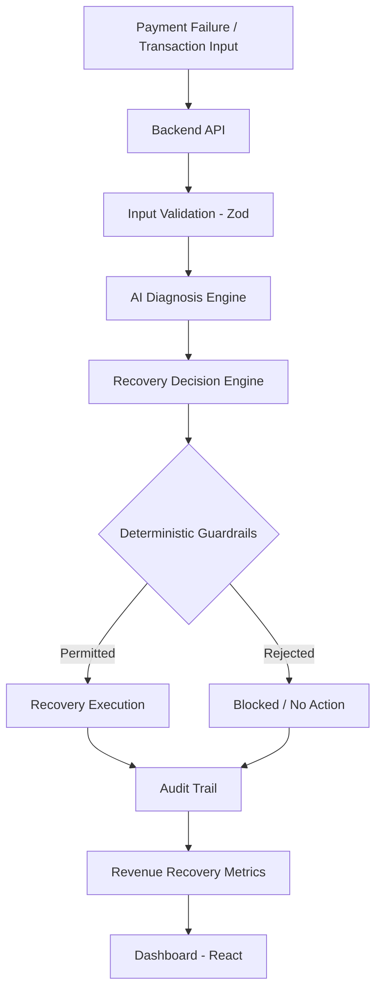
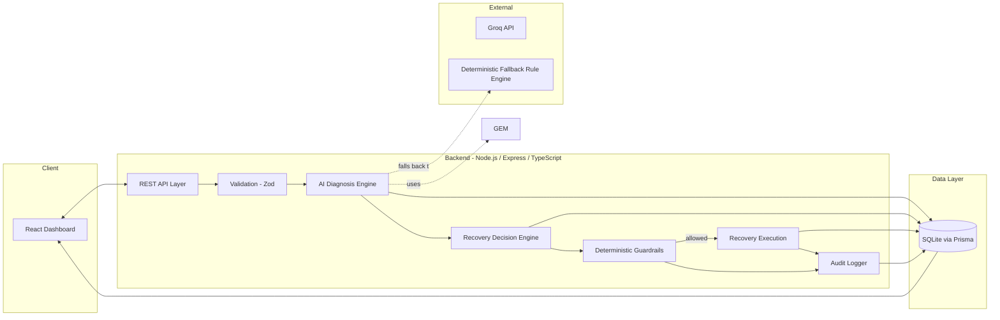
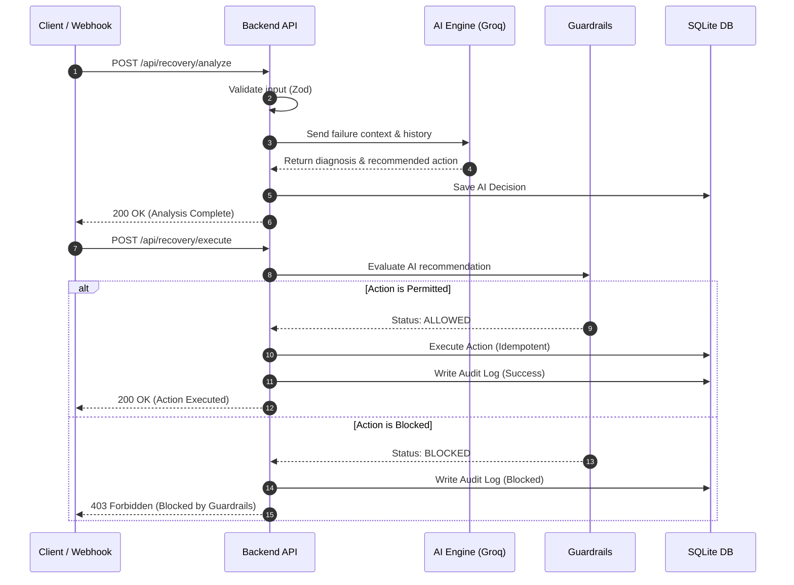

<div align="center">

# RazorRevive AI Revenue Recovery Agent

**An AI-diagnosed, guardrail-enforced payment recovery system built for the Razorpay Buildathon.**

*The goal isn't to retry more payments. The goal is to recover more legitimate revenue safely.*


</div>

---

## Demo

> **[Demo GIF / Screenshots]** — add a short screen recording or 2–3 dashboard screenshots here before submission.

**What the demo shows:**

1. Payment failure enters the recovery pipeline
2. Input is validated
3. AI diagnoses the failure
4. Recovery Decision Engine proposes an action
5. Deterministic guardrails approve or reject it
6. Approved recovery is executed
7. Complete decision chain is recorded
8. Recovery metrics are reflected on the dashboard

### Test Credentials (Admin Dashboard)
- **Email:** `admin@razor.com`
- **Password:** `buildathon2026`

---

## 1. Overview

A failed payment is not automatically lost revenue — but it isn't automatically recoverable either. Different failures (insufficient funds, expired instruments, bank timeouts, gateway errors) call for different recovery strategies, and retrying indiscriminately can hurt conversion, duplicate charges, and degrade customer trust.

**RazorPay AI Revenue Recovery Agent** is an end-to-end system that treats payment recovery as a decision problem, not a retry loop. An AI diagnosis layer reasons about *why* a payment likely failed and *what* recovery path makes sense. A deterministic backend then decides *whether* that action is actually allowed, and only then executes it. Every step — from input to outcome — is recorded for audit.

This is a buildathon prototype built to explore that architecture, not an official Razorpay product and not a production deployment.

---

## 2. Why This Problem Matters

In any payments business, failed transactions are a routine, high-volume event. The naive response — retry everything, immediately, the same way — is cheap to build and expensive to run:

- **Wasted attempts** on payments that will never succeed (e.g., a card that's been cancelled).
- **Customer friction** from repeated retry notifications or duplicate charge attempts.
- **Operational blindness** — no structured record of why a recovery attempt was made or what happened.
- **No way to measure** whether recovery efforts are actually working.

A recovery system that can tell recoverable failures apart from unrecoverable ones, act only within safe bounds, and log its reasoning is a meaningfully different engineering problem than "retry the payment."

---

## 3. Core Differentiator: AI Recommends, Rules Decide, Backend Executes

This is the architectural spine of the entire project.

```
                 AI
          Diagnose & Recommend
                  ↓
        Deterministic Guardrails
             Decide What
               Is Allowed
                  ↓
             Backend
              Executes
                  ↓
             Audit Trail
                  ↓
        Revenue Recovery Metrics
```

The AI layer never directly executes a financial action. It produces a diagnosis and a recommended recovery direction. A deterministic guardrail layer — plain, testable, auditable backend logic — decides whether that recommendation is permitted given the payment context, business rules, and safety constraints. Only actions that clear the guardrails are executed, and the execution, decision, and diagnosis are all persisted together.

This means the system's safety properties do not depend on trusting an LLM's output — they depend on deterministic code that can be tested like any other backend logic.

---

## 4. End-to-End Architecture



**High-level system view:**


---

### Request Lifecycle



---

## 5. Detailed System Flow

| Step | Component | Responsibility |
|---|---|---|
| 1 | **Backend API** | Receives payment failure / recovery request |
| 2 | **Input Validation (Zod)** | Rejects malformed or invalid payloads before any business logic runs |
| 3 | **AI Diagnosis Engine** | Analyzes payment context, infers likely failure cause and recovery direction |
| 4 | **Recovery Decision Engine** | Converts diagnosis + context into a candidate recovery action |
| 5 | **Deterministic Guardrails** | Validates the candidate action against fixed, testable rules |
| 6 | **Recovery Execution** | Executes only guardrail-approved actions |
| 7 | **Audit Trail** | Persists the full input → diagnosis → decision → guardrail result → execution → outcome chain |
| 8 | **Revenue Recovery Metrics** | Aggregates outcomes into recovery-oriented metrics |
| 9 | **Dashboard** | Visualizes the pipeline and its outputs for an operator |

Each stage is a discrete, inspectable unit — not a single opaque "AI does everything" call.

---

## 6. AI Diagnosis Engine

The AI Diagnosis Engine takes structured payment/recovery context (failure reason codes, payment metadata, prior attempt history) and produces a **diagnosis**: a structured judgment about the likely cause of failure and which recovery direction is plausible.

Important boundary: the AI diagnoses and recommends. It does **not** have direct control over whether a payment action is executed — that authority sits entirely with the downstream guardrail and execution layers. The AI's output is treated as an untrusted recommendation, not an instruction.

When the underlying Groq API key is unavailable, the engine degrades gracefully to a **deterministic fallback rule engine**, so diagnosis capability doesn't disappear when the LLM dependency is absent — it becomes rule-based instead.

---

## 7. Recovery Decision Engine

The Recovery Decision Engine takes the AI's diagnosis and the payment's context and produces a concrete candidate recovery action, rather than applying a single hardcoded retry to every failure. Different diagnoses lead to different candidate actions — the decision layer is what turns "why did this fail" into "what should we try."

This is the layer that separates the project from a blind retry-everything approach: the action proposed depends on the specific failure scenario being reasoned about.

---

## 8. Deterministic Guardrails

This is the safety backbone of the system.

Guardrails are plain backend logic — not model output — that check whether a proposed recovery action is actually allowed to run. They protect the system from:

- Unsafe actions suggested by the AI layer
- Invalid or out-of-bounds recovery attempts
- Duplicate or redundant recovery execution

### Stopping Rules

To prevent runaway retry loops and ensure safe degradation, the guardrail engine enforces the following deterministic stopping rules:

- **Maximum retry attempts per payment/customer**: Caps the number of times a `RETRY` action can be recommended for a specific failure (currently 2).
- **Cooldown between attempts**: Enforces a minimum time window (currently 30 minutes) between any successive automated recovery actions for the same payment.
- **Duplicate-action prevention**: Blocks identical recovery actions (e.g., sending another payment link) if one is already pending.
- **Human review escalation after maximum failures**: Automatically blocks and escalates the case to human review if the total number of failed recovery attempts of any type reaches the maximum limit (currently 3).

**Phase 12 hardening** extended this layer with:

- Schema and input validation
- Centralized error handling
- Security middleware
- Security headers
- Rate limiting
- Malformed-input handling
- Dedicated guardrail test suite
- Dedicated AI-service test suite

Because guardrails are deterministic, they are unit-testable in the same way as any other backend rule — this is what makes the safety properties of the system verifiable rather than assumed.

---

## 9. Recovery Execution

Only actions that pass **both** backend input validation and guardrail approval reach the execution layer. Execution is intentionally the narrowest part of the pipeline — by the time an action gets here, it has already been validated, diagnosed, decided, and permitted.

---

## 10. Audit Trail

Every meaningful recovery decision is traceable end-to-end:

```
Input → Diagnosis → Decision → Guardrail Result → Execution → Outcome
```

In a fintech context, this matters for reasons beyond debugging:

- **Accountability** — every automated action taken on a payment has a reconstructable reason.
- **Trust** — an AI-influenced system handling money needs to be explainable after the fact, not just performant in the moment.
- **Iteration** — being able to see what was diagnosed vs. what was actually permitted/executed makes it possible to evaluate and improve the decision logic over time.
- **Compliance-readiness** — even in a prototype, building auditability in from the start reflects how a real financial system would need to operate.

---

## 11. Revenue Recovery Metrics

The system is designed to measure **recovered revenue**, not retry volume. The metrics layer is built around concepts such as:

| Metric | What it represents |
|---|---|
| Failed payments | Total payments that entered the recovery pipeline |
| Recoverable payments | Payments the AI/decision layer judged as having recovery potential |
| Recovery attempts | Actions actually approved and executed by the guardrail layer |
| Successful recoveries | Recovery attempts that resulted in a successful outcome |
| Recovered revenue | Value associated with successful recoveries |
| Recovery effectiveness by scenario | How different failure types/strategies compare in outcome |

No specific numerical business results are claimed here — the metrics above describe what the system is built to track, not a demonstrated production result.

---

## 12. Dashboard / Frontend

A React-based operational dashboard visualizes the recovery pipeline and its outputs — surfacing diagnoses, decisions, guardrail outcomes, and recovery metrics in one place. 

Recent enhancements include:
- **Secure Admin Authentication:** A premium, glassmorphism-styled login portal protected by JWT authentication and encrypted passwords.
- **Dynamic Performance Analytics:** Real-time data visualization using Recharts. The dashboard aggregates actual database metrics to calculate Win-Back Rates, Churn Risks, Payment Method breakdowns, and AI Confidence Cohort trajectories over time.

---

## 13. Demo Scenarios

The system supports multiple realistic payment/recovery scenarios rather than a single scripted path. Because the AI Diagnosis Engine and Recovery Decision Engine respond to the specific context of each failure, different scenarios produce different diagnoses, different candidate actions, and different guardrail outcomes — which is the core proof point that this isn't a single hardcoded retry flow wearing an AI label.

---

## 14. Security & Reliability

| Concern | Mechanism |
|---|---|
| Admin Access | JWT-based authentication, bcrypt hashed passwords, protected React routes |
| Input integrity | Zod schema validation at the API boundary |
| Unsafe AI output | Deterministic guardrail layer |
| HTTP hardening | Helmet security headers |
| Abuse prevention | Express Rate Limit |
| Failure handling | Centralized error handling middleware |
| AI unavailability | Deterministic fallback rule engine when Groq API key is absent |

The system is a hardened buildathon prototype — it is **not** claimed to be production-ready or 100% reliable. Phase 12 was specifically about closing gaps in input handling, error handling, and test coverage.

---

## 15. Testing & Verification

**Phase 12 verification results:**

- 3 test suites passing
- 19 tests passing
- Malformed recovery requests are validated and correctly return **HTTP 400**, rather than causing a server crash or **500**
- Security headers verified as applied
- Rate limiting verified as applied
- Centralized error handling verified as present
- Dedicated guardrail tests and AI-service tests included

Testing is implemented with **Jest**.

---

## 16. Technology Stack

| Layer | Technology |
|---|---|
| Frontend | React, Tailwind CSS, Recharts, Lucide React, Axios |
| Backend | Node.js, Express.js, TypeScript |
| Data | Prisma ORM, SQLite (development database) |
| Security | JSON Web Tokens (JWT), Bcrypt, Zod, Helmet, Express Rate Limit |
| AI | Groq API integration, deterministic fallback rule engine |
| Testing | Jest |
| Tooling | npm, Git / GitHub |

No infrastructure beyond what's listed above (e.g., no Postgres, Redis, Kafka, Kubernetes, LangChain, vector databases, or third-party LLM providers other than Groq) is used in this build.

---

## 17. Project Architecture (Folder Overview)

```
Recovery-Agent/
├── backend/
│   ├── src/
│   │   ├── controllers/        # auth.controller.ts, recovery.controller.ts, 
│   │   │                       # dashboard.controller.ts
│   │   ├── routes/             # auth.routes.ts, recovery.routes.ts, dashboard.routes.ts
│   │   ├── services/           # ai.service.ts, guardrail.service.ts,
│   │   │                       # recovery.service.ts, simulation.service.ts
│   │   ├── validators/         # recovery.validator.ts (Zod schemas)
│   │   ├── middleware/         # errorHandler.ts, auth.middleware.ts
│   │   ├── __tests__/          # ai.service.test.ts, guardrail.service.test.ts,
│   │   │                       # e2e.test.ts
│   │   ├── db.ts
│   │   └── index.ts            # Express app entrypoint
│   ├── prisma/                 # schema.prisma, seed.ts, migrations, dev.db
│   ├── jest.config.js
│   └── package.json
├── frontend/
│   ├── src/
│   │   ├── components/
│   │   │   ├── dashboard/      # DashboardHeader, KPIGrid, OutcomeChart,
│   │   │   │                   # RecoveryFunnel, FailureReasons, TopCases,
│   │   │   │                   # RecentActivity, QuickActions
│   │   │   ├── case/           # RecoveryActionPanel
│   │   │   └── ui/             # AuthContext.tsx, ThemeContext, ToastContext
│   │   ├── pages/              # Login.tsx, Dashboard.tsx, Performance.tsx, AuditLogs.tsx
│   │   ├── lib/                # api.ts (Axios instance with JWT interceptors)
│   │   └── __tests__/
│   └── package.json
├── docs/
│   ├── architecture.md
│   └── engineering-decisions.md
└── README.md
```

---

## 18. Setup & Installation

```bash
# Clone the repository
git clone https://github.com/Lochit-Vinay/Recovery-Agent.git
cd Recovery-Agent

# Install backend dependencies
cd backend
npm install

# Install frontend dependencies
cd ../frontend
npm install
```

Set up environment variables for the backend (e.g. `GROQ_API_KEY`, database URL). If `GROQ_API_KEY` is not provided, the AI Diagnosis Engine automatically falls back to its deterministic rule engine.

---

## 19. Running the Application

### Option A: Using Docker (Recommended)

The easiest way to run the entire stack is using Docker Compose:

```bash
docker-compose up --build
```
This will start both the frontend (port 5173) and backend (port 3001) simultaneously. 

### Option B: Manual Setup

```bash
# Run backend
cd backend
npm run dev

# Run frontend (separate terminal)
cd frontend
npm run dev

# Run tests
cd backend
npm test
```

---

## 20. API Overview

All routes are mounted under `/api`. A separate `GET /health` endpoint reports service liveness.

| Method | Endpoint | Purpose |
|---|---|---|
| `POST` | `/api/auth/login` | Authenticate an admin user and issue a JWT token |
| `GET` | `/api/recovery/cases` | List all recovery cases, each with its latest payment, AI decision, guardrail evaluation, and recovery action |
| `GET` | `/api/recovery/cases/:id` | Get full details for a single case, including complete decision and audit history |
| `POST` | `/api/recovery/analyze/:id` | Run the AI Diagnosis + Recovery Decision Engine for a case **without** executing any action (rate-limited: 100 requests / 15 min per IP) |
| `POST` | `/api/recovery/execute/:id` | Execute a guardrail-approved recovery action for a case, using an idempotency key to prevent duplicate execution (rate-limited: 50 requests / 15 min per IP) |
| `POST` | `/api/recovery/cases/:id/approve` | Approve a case that has been escalated for manual review |
| `POST` | `/api/recovery/simulation/run` | Run a batch simulation across multiple recovery scenarios |
| `GET` | `/api/dashboard/metrics` | Retrieve aggregated recovery metrics for the dashboard |
| `GET` | `/api/dashboard/performance` | Retrieve dynamic KPI, payment method aggregation, and cohort analysis metrics for Recharts |
| `GET` | `/health` | Basic health check |

A global rate limiter (100 requests / 15 min per IP) also applies to all `/api` routes, with the tighter per-route limits above layered on top for the analyze and execute endpoints specifically.

---

## 21. Example Recovery Flow

1. A payment fails with a specific failure reason code.
2. The backend validates the incoming payload (Zod). Malformed input is rejected with `400` before reaching business logic.
3. The AI Diagnosis Engine (Groq, or the fallback rule engine if unavailable) analyzes the context and produces a diagnosis.
4. The Recovery Decision Engine turns that diagnosis into a candidate recovery action.
5. The Deterministic Guardrails layer checks the candidate action against fixed rules and either approves or blocks it.
6. If approved, the Recovery Execution layer carries out the action; if blocked, no action is taken.
7. The full chain — input, diagnosis, decision, guardrail result, execution, outcome — is written to the audit trail.
8. Revenue Recovery Metrics are updated and reflected on the dashboard.

---

## 22. Engineering Decisions & Design Principles

- **Separate recommendation from authority.** The AI never gets to directly execute a financial action — it only ever recommends.
- **Guardrails as code, not prompts.** Safety logic lives in testable, deterministic backend code rather than being asked of the model.
- **Fail closed, not open.** Guardrail rejection means no execution, not a lesser action.
- **Degrade gracefully.** The system keeps functioning (via the fallback rule engine) even without access to the Groq API.
- **Audit everything that matters.** Every stage of the pipeline is logged, not just the final outcome.
- **Optimize for legitimate recovered revenue, not retry count.** Metrics are structured around outcomes, not activity volume.

---

## 23. Future Improvements

*The following are proposed directions, not implemented features:*

- Expanding the guardrail rule set to cover a broader range of payment failure categories
- Adding configurable business-rule policies per merchant/use case
- Introducing a persistent production-grade database (currently SQLite for development)
- Building richer analytics/visualizations into the dashboard
- Adding role-based access control for the operational dashboard
- Extending automated test coverage to additional edge cases and load scenarios

---

## 24. Buildathon Note

This project was built for the Razorpay Buildathon as an exploration of how AI-driven diagnosis can be combined with deterministic, auditable backend controls in a payments context. It is a prototype intended to demonstrate architectural thinking around **safe automation in fintech** — it is not an official Razorpay product, does not use production Razorpay data or infrastructure, and is not deployed in production.

The central idea it tries to demonstrate:

> **AI decides what is likely to work. Deterministic backend guardrails decide what is allowed. The backend executes only permitted actions. The system records the decision and outcome. Revenue impact is measured.**

<br />

---

<div align="center">

## 🚀 Crafted with ❤️ by **Lochit Vinay**

*Building technology that creates real-world impact.*

⭐ **If you found RazorRevive AI useful, consider giving this repository a star!**

</div>

