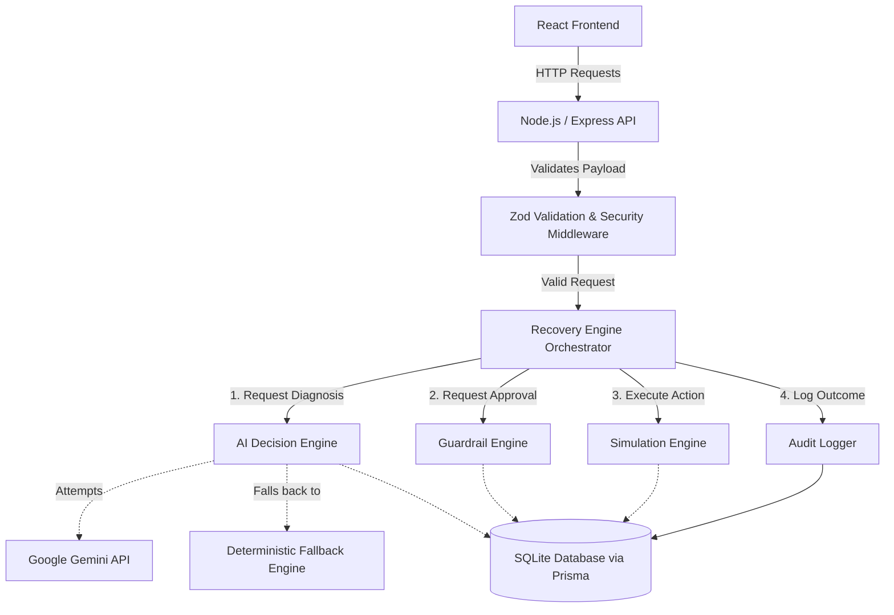

# Architecture

## System Architecture

The RazorPay AI Revenue Recovery Agent is built around a decoupled architecture where AI intelligence is strictly separated from execution authority. The **Recovery Engine** acts as the central orchestrator for the entire pipeline.

### Component Breakdown

1. **API & Security Layer (`index.ts`, `recovery.validator.ts`)**: 
   - Receives incoming requests and protects the application using Helmet (HTTP headers), Express Rate Limit (abuse prevention), and CORS restrictiveness.
   - Uses **Zod** to strictly validate all incoming payloads (e.g., ensuring `idempotencyKey` is present and valid).
2. **Recovery Engine (`recovery.service.ts`)**: 
   - The central orchestrator. It never makes decisions itself; instead, it sequences calls to the AI, Guardrails, and Simulation engines, ensuring state transitions happen atomically.
3. **AI Decision Engine (`ai.service.ts`)**: 
   - Analyzes the context of a failed payment (customer history, failure reason) to determine the likely root cause and recommend an action. 
   - **Graceful Degradation**: It attempts to use the Gemini REST API but will seamlessly fall back to a local, deterministic rule engine if the API key is missing or invalid.
4. **Guardrail Engine (`guardrail.service.ts`)**: 
   - The strict deterministic safety net. Before the Recovery Engine executes *any* action, the Guardrail Engine evaluates it against hardcoded rules (e.g., "Has the max retry limit been exceeded?", "Is the amount over the $50,000 threshold?"). 
   - If the AI suggests an unsafe action, the Guardrail Engine blocks it, guaranteeing financial safety.
5. **Simulation Engine (`simulation.service.ts`)**: 
   - Handles the probabilistic outcomes of executed actions (e.g., deciding if a RETRY attempt succeeds or fails based on predefined probabilities) to produce realistic demo scenarios and dashboard metrics.

### Why AI Does Not Directly Execute Money Actions
LLMs are probabilistic and prone to hallucination. In a payments context, allowing an LLM to directly trigger a retry loop or a refund could result in catastrophic financial loss for the merchant or severe customer friction. 

By decoupling the "Decision" (AI Decision Engine) from the "Execution" (Guardrail Engine & Recovery Engine), we leverage the reasoning intelligence of the LLM while maintaining the absolute safety of a deterministic system. The AI's output is treated strictly as an untrusted *recommendation*.

### Security & Hardening (Phase 12)
The backend enforces production-like security constraints:
- **Idempotency**: Every execution request requires a UUID `idempotencyKey`. If a network timeout occurs and a request is retried, the system safely ignores the duplicate request.
- **Strict Validation**: Malformed requests bypass business logic entirely and return HTTP `400 Bad Request` via Zod.
- **Global Error Handling**: Stack traces are abstracted away from responses, preventing information leakage.

### The Audit Trail
A core requirement of the system is absolute traceability. The **Audit Logger** records every phase of the recovery pipeline:
- `AI_DIAGNOSIS_COMPLETED`
- `GUARDRAIL_EVALUATED`
- `RECOVERY_ACTION_EXECUTED`
- `PAYMENT_RECOVERED` or `PAYMENT_RECOVERY_FAILED`

This unbroken chain of events ensures that any action taken on a payment can be completely reconstructed, explaining *why* the AI recommended it, *why* the guardrails allowed it, and *what* the ultimate outcome was. This data directly powers the UI's Recent Activity feed and Case details view.
