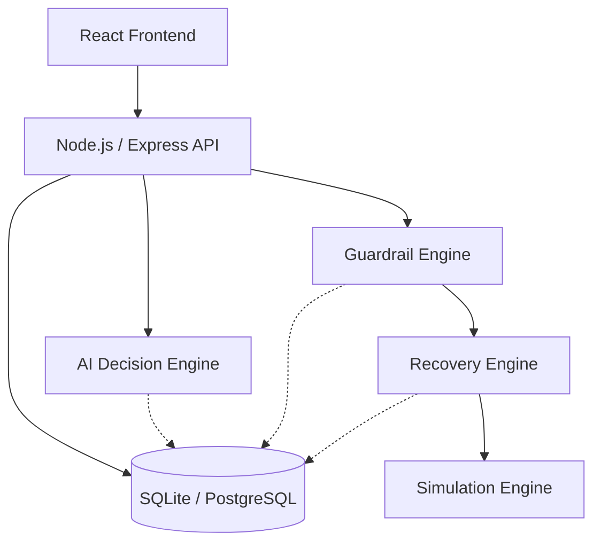

# Architecture

## System Architecture

### Why AI does not directly execute money actions
LLMs are probabilisitic. They hallucinate. In a payments context, allowing an LLM to directly trigger a retry loop or refund could result in catastrophic financial loss for the merchant. By decoupling the "Decision" (AI) from the "Execution" (Guardrails), we get the intelligence of the LLM with the safety of a deterministic system.

### How Guardrails Work
Before any action (like RETRY) is executed, the Guardrail Engine checks the deterministic rules:
- Has this transaction already succeeded?
- Has the max retry limit been exceeded?
- Is the amount under the risk threshold?
- Is there already a pending action?

### Idempotency
Every executed recovery action generates a UUID `idempotencyKey` stored in the database. This prevents double-execution if the network times out during an API call.
